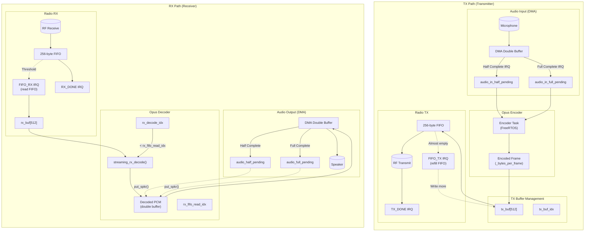
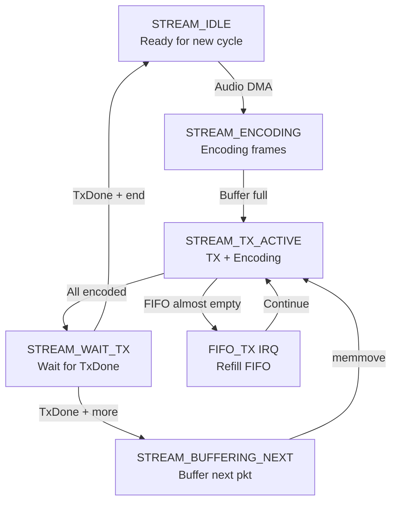
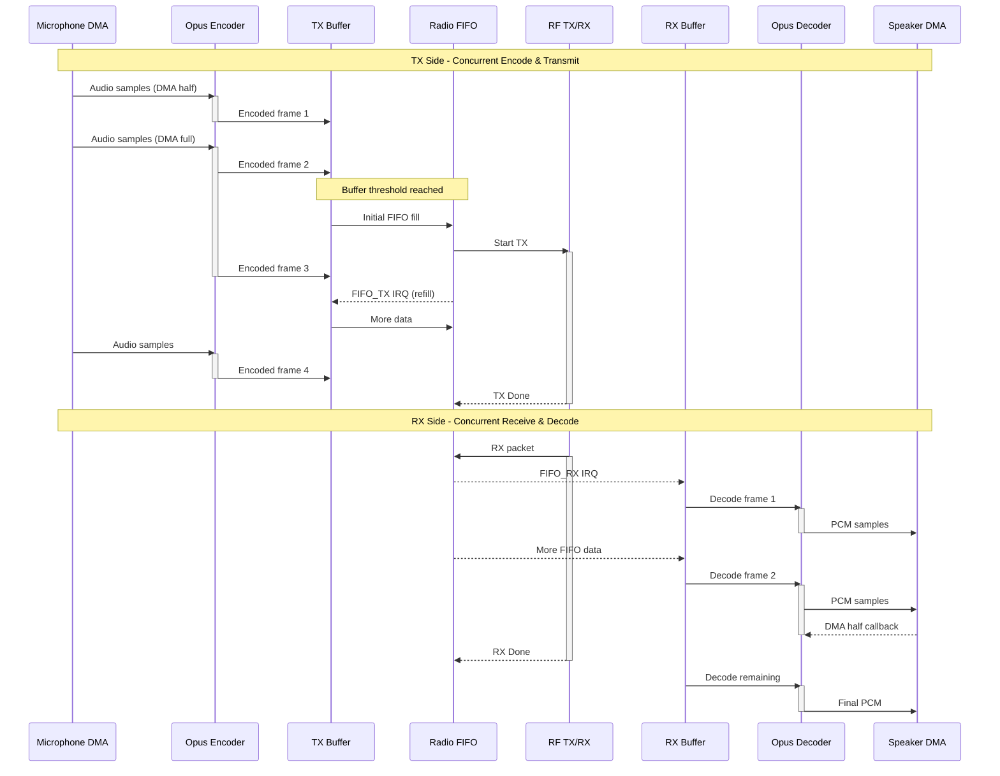

# Opus Streaming Flow Diagrams

## System Overview



## TX Stream State Machine



## Concurrent Operation Sequence



## Timing Constraints

```
TX Timing - Single Packet Mode (60ms Opus frame period)

Time(ms)  0    20    40    60    80   100   120   140   160   180
          |-----|-----|-----|-----|-----|-----|-----|-----|-----|
Audio DMA |<--- DMA Half --->|<--- DMA Full --->|<--- DMA Half -->|
          |     960 samp     |     960 samp     |     960 samp    |

Encoder   |Enc1 |           |Enc2 |            |Enc3 |
          |~25ms|           |~25ms|            |~25ms|

Radio TX                    |<-- Packet TOA -->|
                            |   ~45ms SF7      |

Margin                                         |<-- Available -->|
                                               |    ~35ms        |

Key: Streaming works when Packet TOA < Frame Period (60ms)
     Higher SF = longer TOA = less margin
     SF12 @ 500kHz ~ 200ms TOA (won't work for streaming)
```



```mermaid
gantt
    title Opus 16kbps LoRa SF7 500kHz - 60ms Frame Period
    dateFormat x
    axisFormat %L

    section Audio DMA
    DMA Half 960 samples     :a1, 0, 60ms
    DMA Full 960 samples     :a2, 60, 60ms

    section Encoder
    Encode Frame 1           :e1, 0, 25ms
    Encode Frame 2           :e2, 60, 25ms

    section Radio TX
    Packet TOA 1             :tx1, 25, 25ms
    Packet TOA 2             :tx2, 85, 25ms

    section Margin
    Margin frame 1           :crit, m1, 50, 10ms
    Margin frame 2           :crit, m2, 110, 10ms
```

### Timing varies by configuration

| Opus Mode | Sample Rate | Frame Period | Bytes/Frame |
|-----------|-------------|--------------|-------------|
| 16 kbps   | 16 kHz      | 60 ms        | 120 bytes   |
| 24 kbps   | 16 kHz      | 60 ms        | 180 bytes   |
| 32 kbps   | 16 kHz      | 60 ms        | 240 bytes   |
| 64 kbps   | 48 kHz      | 60 ms        | 480 bytes   |
| 96 kbps   | 48 kHz      | 60 ms        | 720 bytes   |

| Radio Config | Packet TOA (255 bytes) | Viable for 60ms? |
|--------------|------------------------|------------------|
| SF5 500kHz   | ~8 ms                  | Yes              |
| SF7 500kHz   | ~25 ms                 | Yes              |
| SF9 500kHz   | ~82 ms                 | No               |
| SF12 500kHz  | ~530 ms                | No               |
| FLRC 650kbps | ~3 ms                  | Yes              |
| FLRC 2.6Mbps | ~1 ms                  | Yes              |

## Key Variables

| Variable | Description |
|----------|-------------|
| `stream_state` | TX state machine state |
| `tx_buf_idx` | Write position in TX buffer |
| `tx_buf_produced` | Bytes produced by encoder |
| `tx_fifo_idx` | Bytes sent to radio FIFO |
| `rx_fifo_read_idx` | Bytes read from radio FIFO |
| `rx_decode_idx` | Bytes decoded by Opus |
| `_bytes_per_frame` | Opus encoded frame size |
| `lora_payload_length` | Radio packet payload size |

## Stream States

| State | Description |
|-------|-------------|
| `STREAM_IDLE` | Ready for new packet cycle |
| `STREAM_ENCODING` | Encoding frames, TX not yet started |
| `STREAM_TX_ACTIVE` | TX started, still encoding more frames |
| `STREAM_WAIT_TX` | All frames encoded, waiting for TX to finish |
| `STREAM_BUFFERING_NEXT` | Buffering next packet while current TX in progress |
