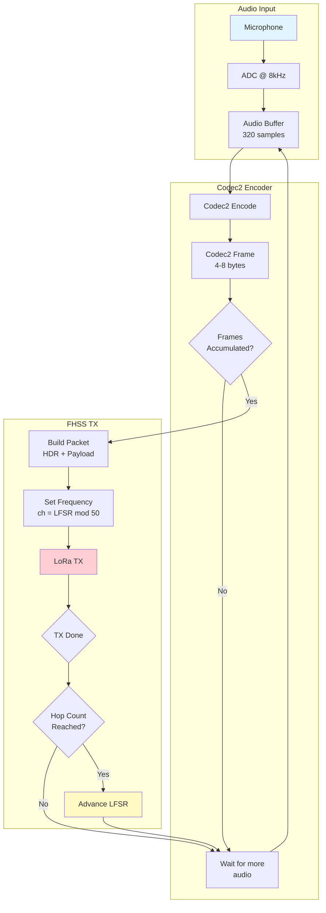
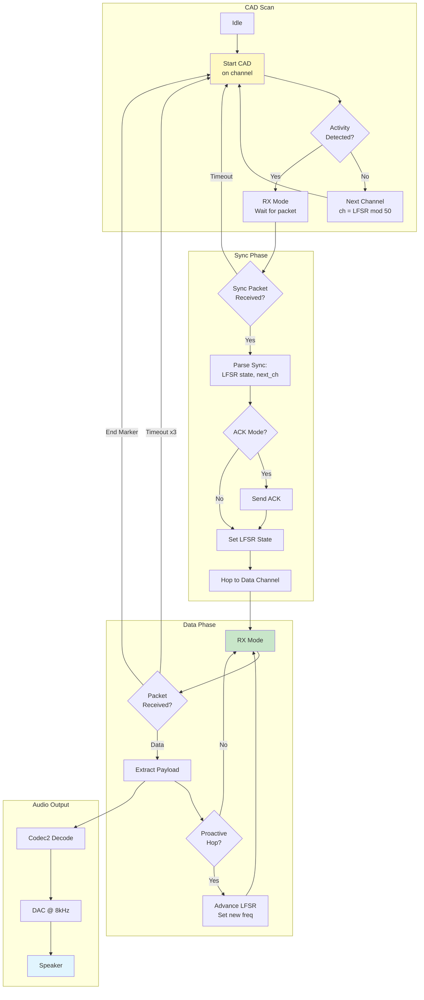
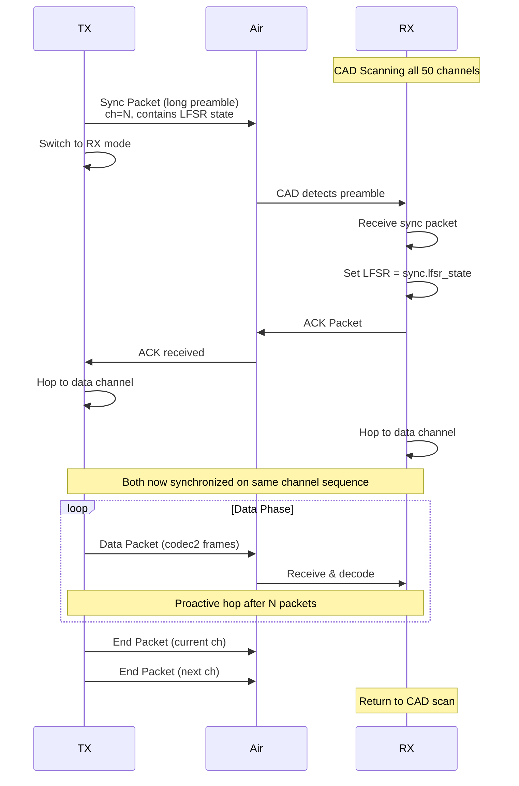
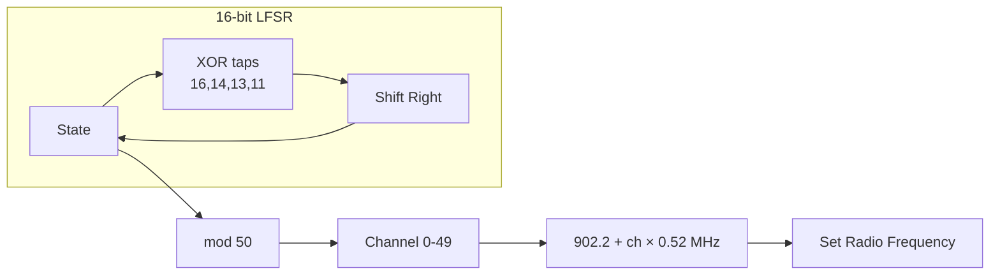

# FHSS Voice System Flow Diagrams

## TX Flow



## RX Flow



## Sync Sequence (ACK Mode)



## Channel Hopping Pattern



## Packet Structure

```
Sync Packet (long preamble ~350ms):
┌──────────┬──────────┬──────────┬──────────┬──────────┐
│ sync_ch  │ next_ch  │ lfsr_hi  │ lfsr_lo  │ hop_cnt  │
│ (1 byte) │ (1 byte) │ (1 byte) │ (1 byte) │ (1 byte) │
└──────────┴──────────┴──────────┴──────────┴──────────┘

Data Packet:
┌──────────┬──────────┬──────────┬─────────────────────┐
│ pkt_type │ seq_num  │ hop_cnt  │ codec2 frames       │
│ (1 byte) │ (1 byte) │ (1 byte) │ (N bytes)           │
└──────────┴──────────┴──────────┴─────────────────────┘

End Packet:
┌──────────┬──────────┬──────────┐
│ 0xFF     │ 0x00...  │ padding  │
│ (marker) │          │          │
└──────────┴──────────┴──────────┘
```
